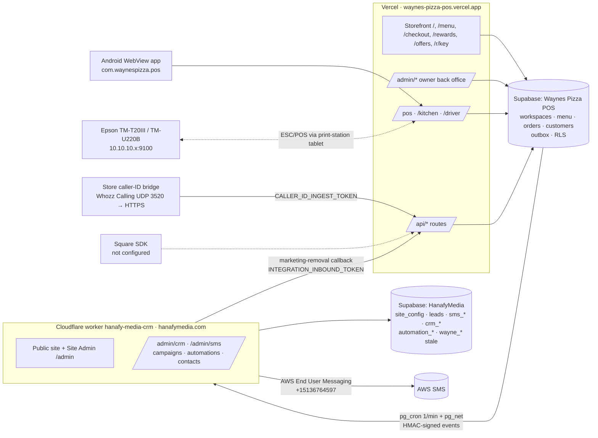

# Hanafy Platform: Phase 0 Repository and Database Audit

**Date:** 2026-09-28
**Scope:** read-only audit before Phase 5 (Workspace shell and service gating). Codex already delivered Phases 1–4 (commits `d2d8188` and `1d743f3`, migrations `20261002…` to `20261005…`). This audit checks those phases against `HANAFY_PLATFORM_MASTER_BUILD_SHEET.md` and maps the whole estate so Phase 5 starts from facts.
**No schema, data or application code was changed.** All database inspection was `SELECT`-only.

**Sources inspected**

| Source | Location | State |
|---|---|---|
| Wayne's POS repo | `~/Downloads/waynes-pizza-pos`, `main` = `origin/main` @ `1d743f3`, clean tree | Deployed to Vercel (`waynes-pizza-pos.vercel.app`) |
| Wayne's DB | Supabase `vxpkdmtornkeoedkawkt` ("Waynes Pizza POS"), 42 migrations, all applied incl. Hanafy Phases 1–4 | Live |
| Hanafy CRM + Site Admin DB | Supabase `lgbdfqpnlvjxdlalhnbk` ("HanafyMedia"), 18 migrations | Live |
| Hanafy CRM + site code | Cloudflare worker `hanafy-media-crm` (last deploy 2026-09-14). **Source not available**: see §0.2 | Audited through its DB only |
| Old public-site repo | `github.com/Youssef-Hanafy/hanafy-media` (public, last commit 2026-09-11) | Stale pre-CRM site |
| Wayne's master spec | `docs/WAYNES_POS_MASTER_BUILD_SHEET.md` (2,325 lines) | Present |
| Wayne's hardware / caller-ID spec | **Not in repo.** Only its reports: `PHONE_BUILD_PHASE_0_AUDIT.md`, `PHONE_BUILD_PHASES_1_5_REPORT.md`, `PHONE_BUILD_PHASES_6_9_REPORT.md`, `PRINTER_SETUP.md`, `ANDROID_APP_SETUP.md` | Partial |
| Hanafy Platform build sheet | **Not in repo** (`docs/HANAFY_PLATFORM_MASTER_BUILD_SHEET.md` does not exist); read from the uploaded copy | Should be committed |

---

## 0. Headline findings (read first)

### 0.1 Live regression caused by Phase 4 (P0)

`1d743f3` changed the storefront and payment config to resolve the tenant by **request hostname** through `workspace_domains`. Only `waynespizzaofworcester.com` and `localhost` are registered. The deployed app runs at `waynes-pizza-pos.vercel.app`, so:

- **https://waynes-pizza-pos.vercel.app now renders "Store unavailable – This storefront has not been configured for this domain."** (verified by fetching the live page). The name, address, phone, hours, tax and delivery settings in the storefront, metadata and footer all fall back to `defaultSettings`.
- `readPaymentSettings()` returns `null` for that host, so online card checkout and the POS terminal route (`/api/pos/terminal`) cannot resolve a payment configuration.
- The Android app is hard-wired to `https://waynes-pizza-pos.vercel.app/pos` (`android/app/build.gradle.kts`), so every register tablet hits the unregistered host.
- `www.waynespizzaofworcester.com` is also unregistered, so it would break the same way at cut-over.

Fix (data only, no code): add the `waynes-pizza-pos.vercel.app` host (and `www.`) to `workspace_domains` for Wayne's / Worcester. This needs your approval because it writes to the live DB. Preview deployments (`*-git-*.vercel.app`) will still show "unavailable". That is correct fail-safe behaviour, but Phase 5 should add an explicit, env-gated preview mapping.

### 0.2 The Hanafy CRM source code is not on this Mac

`~/Downloads/hanafy-retention-v1` is **not** the CRM. Its `origin` is `Waynes-pizza-pos.git`, and it is an older Wayne's clone on branch `codex/push-waynes-updates` with uncommitted changes. The live CRM worker was last deployed 2026-09-14 from a source tree I cannot see. The CRM findings below come from its database, which is authoritative for data and RLS. A code-level audit of Campaign Manager, the automation worker and AWS sending needs that repo: please point me to it or add the folder.

### 0.3 There are two Supabase projects, and the build sheet requires one

Wayne's POS (`vxpkdmtornkeoedkawkt`, us-east-2) and Hanafy CRM + Site Admin (`lgbdfqpnlvjxdlalhnbk`, us-west-2) are separate databases. Phases 1–4 built workspaces, members, services and RLS **inside the Wayne's DB**. The CRM already has its own tenant model (`sms_businesses`, `sms_business_members`, `sms_platform_admins`). The platform therefore now has **two tenant roots, two membership tables, two platform-admin tables and two customer stores**. Build-sheet §4.1 ("one shared Hanafy Supabase project") and Phase 7 ("migrate CRM `business` to workspaces") cannot be met without a consolidation decision. See §17 and §18.

### 0.4 Phase 3 tenancy is a Wayne-only bridge, not multi-tenant yet

- 150 of 152 `wayne_*` SECURITY DEFINER functions never reference `workspace_id`. They authorize with `wayne_has_permission(code)`, which is **hard-wired to Wayne's workspace UUID** `40000000-0000-4000-8000-000000000001`.
- Every tenant table has a `BEFORE INSERT` trigger (`hanafy_assign_legacy_*_scope`) that **defaults a missing `workspace_id`/`location_id` to Wayne's/Worcester**. Service-role routes (`/api/rewards`, `/api/phone/calls`, `/api/integrations/hanafy/*`, card webhooks) rely on this default.
- `wayne_public_menu`, `wayne_public_promotions`, `wayne_store_is_open` and `wayne_public_order_status` are anon-callable and unscoped. With a second tenant they would return both tenants' menus and promotions.
- 20+ unique constraints are still global (see §16.3), e.g. `customers.phone_normalized`, `orders.order_number`, `promotions.code`.

This is safe **while Wayne's is the only workspace**. It violates §2 rules "no silent fallback to Wayne's", "no globally unscoped operational query", and §7.1 items 7, 9 and 10. **No second real or test workspace may be created in the live DB until this is closed.** Automated test tenants in PGlite are fine.

### 0.5 Phase 4 seeded the wrong SMS sender

`workspace_messaging_identities` (sms) for Wayne's has `sender_address = (508) 852-6326`, the store landline, with `provider = 'aws'`. The real AWS origination identity is `+15136764597` (`phone-ae22…`, us-east-1, PROMOTIONAL), and it lives in the CRM DB (`sms_aws_sending_identities` / `business_sending_identities`). Nothing sends from the Wayne's-DB row yet, so there is no live harm. It is the exact "wrong-number fallback" risk the build sheet warns about (§19.3), so it must be corrected or removed before anything reads it.

### 0.6 Service entitlements don't match reality

Wayne's `workspace_services` enables 10 services but **not `sms`, `email` or `automations`**, even though Wayne's Rewards texts go out today through the CRM. If Phase 5 gating enforces as seeded, it would hide or block Wayne's marketing. The seed must be corrected first. Workspace `status` also lacks `provisioning`, and `workspace_services.status` lacks `suspended`, both of which the build sheet requires.

### 0.7 No Phase 1–4 completion reports exist

Codex did not add the required completion reports, and I can't confirm its tests were run. `node_modules` is macOS-only, so they can't run from here. The tests exist (`tests/hanafy-phase{1..4}-*.test.ts` using PGlite, `supabase/tests/011/012`). **Run `npm run verify` on the Mac before Phase 5.**

---

## 1. Current architecture map

**Dependency direction:** POS → (outbox, async) → CRM → AWS. The POS never waits on the CRM, which matches §18. The CRM calls back into Wayne's for marketing removals.

## 2. Repository / app structure (Wayne's POS)

Next.js 16 App Router, React 19, TypeScript, Tailwind v4, Zod, Vitest + PGlite, Playwright. One app, no monorepo.

| Area | Paths |
|---|---|
| Public storefront | `src/app/{page,menu,checkout,order,order/[id],rewards,offers,r/[key],about,contact,terms,privacy}` |
| Back office | `src/app/admin/{audit,calendar,cash,customers,delivery,hardware,integrations,menu,orders,payments,pilot,printing,promotions,reports,segments,settings,staff}` |
| Operations | `src/app/pos`, `src/app/kitchen`, `src/app/driver` |
| API (29 routes) | `orders`, `payments/card`, `webhooks/square`, `pos/*` (customers, drafts, drawer, open-orders, orders, payments, terminal), `phone/*`, `kitchen`, `driver`, `rewards*`, `reports/export`, `integrations/hanafy/{worker,marketing-removal}` |
| Domain libs | `src/lib/{audit,auth,cash,content,customers,dashboard,delivery,errors,hardware,images,integrations,kitchen,logging,menu,monitoring,orders,payments,phone,pilot,pos,printing,promotions,reports,staff,supabase,tenancy,time,wayne}` |
| Hardware adapters | `src/hardware/{caller-id,drawer,payments,printers,native}` + `event-bus.ts`, `runtime.ts` |
| Client state | `src/stores/*` (order drafts, phone, print station, hardware) |
| Tenancy (new) | `src/lib/tenancy/{context,permissions,schemas}.ts`: `requireWorkspaceContext()` exists but **no route calls it yet** |
| Route guard | `src/proxy.ts`: auth-only on `/admin`, `/pos`, `/kitchen`, `/driver` |
| Android | `android/` plain WebView shell + native caller-ID / printer bridge |
| DB | `supabase/migrations` (42), `supabase/tests` (12 pgTAP), `tests/` (Vitest + PGlite) |

## 3. Database table map (Wayne's DB, 66 public tables, RLS on all)

| Group | Tables | Scope today |
|---|---|---|
| **Tenancy (Ph1)** | `workspaces`, `locations`, `workspace_members`, `platform_users`, `service_catalog`, `workspace_services` | root |
| **Config (Ph4)** | `workspace_settings`, `location_settings`, `workspace_domains`, `workspace_messaging_identities`, `location_payment_configurations`, `location_hardware_configurations`, `location_caller_lines` | ws / ws+loc |
| **Legacy config (singletons)** | `store_settings` (PK `id boolean = true`), `store_special_hours`, `payment_provider_settings`, `pos_hardware_settings`, `store_phone_lines` | ws+loc, still read by 17 legacy functions |
| **Identity / RBAC** | `profiles`, `roles` (6, **global**), `permissions` (26, global), `role_permissions` | global |
| **Menu** | `menu_categories`, `menu_items`, `menu_item_variants`, `modifier_groups`, `modifier_choices`, `menu_item_modifier_groups`, `modifier_choice_variant_prices`, `menu_item_included_choices` | ws |
| **Customers / CRM** | `customers`, `customer_phones`, `customer_addresses`, `marketing_consents`, `customer_segments`, `customer_segment_memberships`, `customer_events`, `customer_segment_evaluation_runs`, `reward_grants` | ws |
| **Orders** | `orders`, `order_items`, `order_item_modifiers`, `order_discounts`, `order_events`, `order_idempotency`, `promotions` | ws(+loc) |
| **Payments / cash** | `payments`, `refunds`, `payment_terminals`, `payment_webhook_events`, `registers`, `register_shifts`, `cash_movements` | ws+loc |
| **Ops** | `kitchen_tickets`, `print_jobs`, `delivery_assignments`, `pos_drafts`, `phone_calls`, `pilot_checks` | ws+loc |
| **Integration** | `integration_destinations` (holds HMAC `signing_secret`), `integration_outbox`, `integration_delivery_logs` | ws |
| **Platform-global** | `audit_log` (ws+loc, immutable), `app_error_events`, `order_request_rate_limits` | global |

Key relationships: `orders → customers`, `order_items → orders / menu_item_variants`, `payments → orders`, `kitchen_tickets / print_jobs → orders`, `phone_calls → customers / orders / pos_drafts`, `customer_phones → customers`, `workspace_members → roles`. **FKs are single-column (`id`), not composite `(workspace_id, id)`,** so nothing stops a child row pointing at a parent in another workspace (§7.1 item 10).

Live volumes: 341 menu items / 2,245 choices, 4 orders, 2 customers, 1 consent, 32 outbox events, 9,902 audit rows, 1 profile (owner). Realtime publication: `kitchen_tickets`, `print_jobs`, `phone_calls`, `pos_drafts`. pg_cron: outbox delivery (every min), stale card-order expiry (5 min), nightly inactivity evaluator.

## 4. Authentication and authorization map

- **Auth:** Supabase Auth email/password. `@supabase/ssr` cookies. `proxy.ts` only checks "logged in".
- **Access resolution:** `getCurrentAccess()` → RPC `hanafy_current_workspace_access()`. It **returns null if the user has more than one active membership** (deliberately ambiguous), then derives role and permissions from that single membership.
- **Page / action guard:** `requirePermission(code)`. Permission codes: 26 Wayne's codes (`customers.view`, `pos.access`, …). They differ from the build sheet's (`customers.read`, `payments.initiate`, …).
- **Roles:** global `roles` table (`owner, manager, cashier, kitchen, driver, marketing_readonly`) reused as workspace roles. Editing a role's permissions changes it for every tenant.
- **Platform admin:** `platform_users` (roles `platform_owner|admin|support|read_only`, no `billing`), with **0 rows**. The CRM DB separately has `sms_platform_admins` (1 row).
- **Staff PIN switching:** not present. Staff sign in with individual Supabase accounts, and only 1 profile exists today. (§8.3 wants register-authorized devices plus PIN switching; nothing in Phases 1–4 addressed it.)
- **Service-role use:** 14 files (`rewards`, `payments/card`, `webhooks/square`, `pos/terminal`, `phone/calls`, `integrations/hanafy/*`, `r/[key]`, `admin/staff`, `admin/orders/[id]`, `lib/payments/config`). All are server-only, but they insert without an explicit `workspace_id` and rely on the Wayne's-default trigger.
- **Machine auth:** `CALLER_ID_INGEST_TOKEN` (store bridge), `INTEGRATION_WORKER_TOKEN`, `INTEGRATION_INBOUND_TOKEN` (CRM callback), `SQUARE_WEBHOOK_SIGNATURE_KEY`. All are single global env values, not per workspace.

## 5. RLS policy map

**Wayne's DB, after Phase 3:** 47 tenant tables share one generated pattern:
- `hanafy_workspace_read` (SELECT): `wayne_has_permission(workspace_id, <perm>)` OR-ed.
- `hanafy_workspace_{insert,update,delete}`: only where a write permission is configured (settings, promotions, menu categories/items, segments, payment settings/terminals, phone lines, hardware settings). Other writes go through SECURITY DEFINER RPCs.
- Triggers: `aa_hanafy_assign_legacy_scope` (defaults to Wayne's) and `zz_hanafy_enforce_tenant_scope` (blocks `workspace_id` reassignment and checks location belongs to workspace).
- `anon` has **no** table grants. Public data flows through anon-executable SECURITY DEFINER RPCs (`wayne_public_menu`, `wayne_public_promotions`, `wayne_public_store_settings`, `wayne_store_is_open`, `wayne_public_order_status`, `wayne_payment_checkout_config`, `hanafy_public_store_settings`).
- Config tables (Ph4): member-read / permission-write. `workspace_messaging_identities` and payment config are readable only with `integrations.manage` / `payments.manage` / `pos.access`.
- Storage: new private bucket `hanafy-workspace-private` with `{workspaceId}/…` prefix policies. Menu images stay in the public bucket, **unprefixed**.
- Platform admin: `hanafy_is_platform_admin()` bypasses permission checks on every table (read and write).
- Advisors: SECURITY DEFINER functions executable by anon/authenticated (expected for RPC design); leaked-password protection **off**; `order_request_rate_limits` has RLS with no policy (intentional).

**CRM DB:** `sms_is_business_member(business_id)` on every `sms_*` / `crm_*` table (any member can read, update and delete; no per-permission checks). `sms_is_platform_admin()` governs `leads`/`site_config`. `site_config` is public-read. `crm_signed_event_sources` has RLS with no policy (service-role only). Its HMAC secret is stored **in plaintext** in `current_secret`; it isn't readable by `authenticated`, but it belongs in a secret store.

## 6. Current business / tenant model

| | Wayne's DB | CRM DB |
|---|---|---|
| Tenant root | `workspaces` (1: Wayne's `40000000-…0001`) | `sms_businesses` (Wayne's `2acaf89c-…`, status `setup`; Magic Razor, **archived**) plus the stale `automation_businesses` (Wayne's `e1d8d0dc-…`) |
| Location | `locations` (Worcester `…0002`) | `wayne_locations` (stale) |
| Membership | `workspace_members` (1 owner) | `sms_business_members` (2 owner rows) |
| Platform admin | `platform_users` (0) | `sms_platform_admins` (1) |
| Cross-DB link | `integration_destinations.business_id` | `crm_signed_event_sources.external_business_id = 'waynes-pizza'` |

Wayne's therefore has **three different UUIDs** across the two DBs. The slug `waynes-pizza` is the only common key. Magic Razor is an archived prospect and must **not** be migrated as a tenant (§26, §43).

## 7. Current CRM / contact model (CRM DB)

`sms_contacts` (business_id, first/last, `phone` + `phone_e164`, email, birthday, `sms_consent`/`email_consent` + sources, opted in/out timestamps, `order_count`, `lifetime_value` **numeric dollars**, `average_order_value`, `last_order_at`, status, notes, custom_fields). There is **no unique (business_id, phone_e164)**. Children: `crm_contact_phones/emails/addresses/notes`, `sms_contact_tags`, `sms_contact_events`, `crm_consent_records` (5), `crm_suppressions`, `crm_customer_external_ids` (1: maps a POS customer to a contact), `crm_orders` (2, order mirror), `crm_deleted_contacts`, `sms_lists`, `crm_lists`, imports.

## 8. Current POS / order / customer model (Wayne's DB)

`customers` (**`phone_normalized UNIQUE` globally**, sms/email opt-in flags, metrics in cents, `offer_link_key`), `customer_phones` (multi-phone, from the phone-line build), `customer_addresses`, `marketing_consents` (auditable events with consent text version). Orders use one model for online / POS / phone. Totals are integer cents, there are immutable item snapshots, an explicit status machine and a separate payment state. Idempotency comes from `orders.idempotency_key`, `order_idempotency` and `pos_drafts.idempotency_key`. Order numbers look like `W001008` and are **globally unique**. Customer erasure scrubs PII and keeps the order.

## 9. AWS messaging architecture

- The POS never talks to AWS. It writes `integration_outbox` rows in the same transaction. pg_cron plus `pg_net` POSTs HMAC-signed events every minute to the CRM worker, and retries are logged in `integration_delivery_logs`.
- The CRM worker holds AWS credentials (Cloudflare secrets, not visible) and sends through **AWS End User Messaging, us-east-1**, origination `+15136764597` (PROMOTIONAL, status approved/active, `live_sending_enabled: true`, 10DLC status null).
- The sender resolves per business: `sms_businesses.default_sms_identity_id` → `sms_aws_sending_identities`. That is **already workspace-scoped in spirit** and should be kept.
- Two duplicate identity tables exist (`sms_aws_sending_identities` and `business_sending_identities`, same id). The Wayne's-DB `workspace_messaging_identities` is a third copy, and a wrong one (§0.5).
- Jobs: `sms_outbound_jobs`, `sms_messages`, `sms_message_events`, `sms_conversations`. The stale `automation_message_jobs` (2) belong to the retired Vercel engine.
- Consent / STOP: `crm_consent_records`, `crm_suppressions`, `sms_keywords` (0), and the marketing-removal callback to Wayne's.

## 10. Payment architecture

- Server `PaymentProvider` (`src/lib/payments/provider.ts`) with a Square implementation (`square.ts`, `square-mapping.ts`), gated by `location_payment_configurations` (provider `none|square`, currently `none`, sandbox, both switches off). Secrets come from env `SQUARE_ACCESS_TOKEN` / `SQUARE_WEBHOOK_SIGNATURE_KEY`, so there is **one set for the whole platform**.
- Counter terminal: `PaymentTerminalProvider` with `ManualExternalTerminalProvider` (the real Wayne's path: the Boston North standalone terminal plus manual confirm). There is a POS Payments screen with cash/change, and the drawer kicks on every payment.
- No raw card data is stored. Square Web Payments tokenises in the browser.
- Gaps against §20: no `payment_connections` / `integration_connections`, no `connection_mode`, no `secret_reference`, and the provider enum is hard-coded `('none','square')`. The online and terminal adapters are two separate interfaces rather than the single `PaymentProviderAdapter`. Webhook routing resolves the tenant **by request host**, which is wrong for provider webhooks (they arrive on the platform host, so it should be by merchant/location id or a per-connection URL).

## 11. Hardware / caller-ID architecture

- `CallerIdProvider` interface with Simulated, Cloud (Supabase realtime on `phone_calls`) and Android (native UDP) implementations. Line 1 and Line 2 are separate. There are claims/locks, auto-pickup on an idle register, no force-navigation, and calls link to drafts and orders.
- Ingest: the store bridge posts to `/api/phone/calls` with a global `CALLER_ID_INGEST_TOKEN`, then `wayne_record_phone_call`, which is **unscoped** and lands on Wayne's through the trigger. Multi-tenant ingest needs a per-device/per-location token.
- Printers: `PrinterProvider`, ESC/POS renderer, and models `epson-tm-t20iii` / `epson-tm-u220b`. A single "print station" tablet drains `print_jobs` over LAN (`10.10.10.161` front, `10.10.10.171` kitchen). The drawer kicks through the receipt printer.
- Config lives in `location_hardware_configurations.configuration` (jsonb, member-readable), mirrored from `pos_hardware_settings`. `location_caller_lines` mirrors `store_phone_lines`. **Two sources of truth.**
- Gaps against §21: no `hardware_devices` registry, ownership, health or last-seen. Realtime subscriptions are **unfiltered** (`postgres_changes` on the whole table, with RLS as the only filter), and channel names are `wayne-*`.

## 12. Campaign and automation architecture

- **Campaign Manager (Lane A):** CRM `sms_campaigns` / `sms_campaign_recipients` (0 rows so far) under `/admin/sms`. Business-scoped. **Keep.**
- **Automation Engine (Lane B):** CRM `sms_automations` (3: "Text club welcome" **live**, "30-day win-back" draft, "Weekly Rewards offers" draft), `sms_automation_nodes/edges/runs/events/run_log`. The trigger comes from signed POS events such as `customer.reward.issued`.
- **Duplicate, retired engine:** `automation_businesses/contacts/events/workflows/versions/runs/run_steps/message_jobs/suppressions/worker_runs` from the abandoned Phase 9 Vercel engine (retired 2026-09-13 but tables still hold rows).
- **POS-side segmentation:** `customer_segments` (8) and a nightly inactivity evaluator that emit `customer.segment.entered/exited` into the outbox.
- Build-sheet §17.3 wants `version`, cooldown and a per-action workspace re-check. That can't be verified without the CRM source.

---

## 13. Wayne's-specific values that must become workspace / location configuration

**Already moved by Phase 4 (done):** store name, story, address, phone, email, hours, tax, tips, delivery rules, prep times, social links, logo, SEO, canonical domain, receipt header/footer, payment provider settings, hardware settings, caller-line count, footer/metadata copy.

**Still hard-coded:**

| # | Value | Where | Target |
|---|---|---|---|
| 1 | Wayne's workspace / location UUIDs | 4 DB functions (`wayne_has_permission`, `hanafy_sync_legacy_waynes_membership`, `hanafy_assign_legacy_*_scope`) | Remove when legacy RPCs are scoped |
| 2 | "Wayne's Rewards" program name, eyebrows, CTAs | `rewards/page`, `r/[key]`, `rewards-signup`, `rewards-section`, `member-offers`, `site-header`, `order-menu-client`, `admin/promotions` | `workspace_settings.feature_defaults.loyalty_program_name` |
| 3 | SMS consent text + version | `src/lib/wayne/rewards.ts` (`WAYNE_REWARDS_CONSENT`) | Per-workspace consent template (versioned) |
| 4 | Terms / privacy copy ("Wayne's Rewards") | `terms`, `privacy`, `legal.ts` | Workspace legal settings |
| 5 | "Call Wayne's Pizza" error copy | `api/orders`, `api/payments/card`, `api/pos/terminal`, `checkout-client`, `menu/page` | `store_name` / `public_phone` |
| 6 | Payment note "Wayne's Pizza order …" | `payments/card`, `pos/terminal` | `store_name` |
| 7 | Checkout opt-in labels "Send me Wayne's Pizza text/email deals" | `checkout-client.tsx` | `store_name` |
| 8 | Default city "Worcester"/"MA" for new addresses | `lib/orders/drafts.ts`, `order-start-gate.tsx` | Location city/state |
| 9 | Phone placeholders "(508) …" | 6 components | Derived from location area code or neutral |
| 10 | Brand colours `--color-wayne-*` (33 tokens) and `bg-wayne-*` classes | `globals.css`, all UI | `workspace_settings.brand_colors` → CSS variables; rename tokens to `--brand-*` |
| 11 | `WayneBadge` sign artwork, `BrandMark`, "Waynes Pizza" image placeholder | `wayne-badge.tsx`, `menu-image.tsx` | Workspace logo asset |
| 12 | Homepage tagline "GOOD FOOD. GREAT NEIGHBORS. THAT'S WAYNE'S." | `site-header.tsx` (fallback) | `homepage_eyebrow` setting |
| 13 | Order number prefix `W` + global sequence | DB order-number function / `orders_order_number_key` | Per-location prefix + sequence |
| 14 | Timezone `America/New_York` default and report comment | `content/schemas.ts`, `reports/export` | `locations.timezone` |
| 15 | Printer model catalogue and help text ("Wayne's has two Epson printers", 9100) | `hardware/printers/models.ts`, `admin/hardware/page.tsx`, `hardware/schemas.ts` | Device registry (Ph10); keep the model catalogue as platform data |
| 16 | "Thrive" pilot wording, Boston North comments | `admin/pilot`, `pilot/schemas`, `payments-screen` | Wayne's-only pilot. Gate as a workspace-specific checklist or retire after go-live |
| 17 | Caller-ID env `CALLER_LINE_COUNT`, `CALLER_ID_PROVIDER`, `CALLER_ID_UDP_PORT`, `CALLER_ID_INGEST_TOKEN` | `src/hardware`, `api/phone/calls` | `location_caller_lines` + per-device token |
| 18 | `WAYNES_URL`, `NEXT_PUBLIC_APP_URL` (single app URL) | integrations, links | `workspace_domains` canonical |
| 19 | Android `applicationId com.waynespizza.pos`, `POS_URL=…vercel.app/pos` | `android/app/build.gradle.kts` | Generic "Hanafy POS" app + device enrolment to a workspace/location |
| 20 | Realtime channel names `wayne-*`, storage keys `wayne.pos.drafts.v1`, `wayne-order-idempotency-v1`, cart / order-details keys | `stores/*`, `checkout`, `menu` | `hanafy:{workspaceId}:{locationId}:…` (§37.3) |
| 21 | Promo `source: "text_daily_website"`, hash salt `text-daily:` | `api/rewards` | Neutral source codes (keep the historical value readable) |
| 22 | Menu images in public bucket without a workspace prefix | storage | `workspaces/{id}/menu/…` (§31.1) |
| 23 | Square as the only provider enum | `location_payment_configurations` check | Provider registry (Ph9) |
| 24 | Global `SQUARE_*` secrets | env | `secret_reference` per connection (Ph9) |
| 25 | Wrong SMS sender `(508) 852-6326` | `workspace_messaging_identities` data | Real identity or remove (§0.5) |
| 26 | Wayne's CRM `business_id` in `integration_destinations` and signing secret per env | Wayne's DB | Per-workspace destination (already per-row, OK) |

## 14. Duplicate systems / tables: migrate, don't expand

| Concept | Copies today | Recommendation |
|---|---|---|
| Tenant | `workspaces` / `sms_businesses` / `automation_businesses` / `wayne_locations` | `workspaces` is canonical. Map `sms_businesses` by slug. Drop `automation_*` after archive |
| Membership | `workspace_members` / `sms_business_members` / `wayne_staff` (CRM, 5 stale) | `workspace_members` |
| Platform admin | `platform_users` (0) / `sms_platform_admins` (1) | `platform_users`; seed Youssef explicitly |
| Customer | `customers` (POS) / `sms_contacts` (CRM) / `automation_contacts` / `wayne_customers` (CRM, 0) | `customers` + `customer_phones` as canonical (§15). CRM contacts become a view or are migrated (Ph7) |
| Consent | `marketing_consents` / `crm_consent_records` / `wayne_customer_consents` | One consent-event table per workspace + `suppression_entries` |
| Orders | `orders` / `crm_orders` (mirror) / `wayne_orders` (CRM, 0) | `orders`; the mirror disappears once in one DB |
| Menu | Wayne's menu tables / `wayne_menu_*` in CRM (4 items, test data) | Wayne's DB menu. **Drop the CRM `wayne_*` shadow schema** (28 tables, mostly empty) |
| Payments config | `payment_provider_settings` / `location_payment_configurations` / `wayne_payment_provider_configs` (CRM) | `location_payment_configurations` → `payment_connections` (Ph9) |
| Printers | `pos_hardware_settings` / `location_hardware_configurations` / `wayne_printers` (CRM) | `hardware_devices` (Ph10) |
| Phone lines | `store_phone_lines` / `location_caller_lines` | `location_caller_lines` → `phone_lines` |
| Store settings | `store_settings` singleton / `location_settings` + `workspace_settings` | New tables; retire the singleton mirror once legacy RPCs are rewritten |
| Messaging identity | `sms_aws_sending_identities` / `business_sending_identities` / `workspace_messaging_identities` | One `messaging_origination_identities` (§19.2) |
| Automations | `sms_automations*` / `automation_workflows*` | `sms_automations*` (the live one) |
| Audit | `audit_log` / `crm_audit_logs` / `wayne_audit_logs` | `audit_log` |
| Segments | `customer_segments` / `sms_segments` / `sms_lists` / `crm_lists` | Decide in Ph7: POS segments feed CRM audiences |

## 15. Already satisfies the build sheet: do not rebuild

- Outbox pattern: same-transaction outbox, HMAC, retry log, idempotent `event_id` (§18).
- Integer-cent money, immutable order snapshots, order state machine, idempotent order creation (§16.2).
- Multi-phone customers, customer erasure model, consent events with text version (§15.2, §19.5).
- Caller-ID provider abstraction, simulator, Line 1/2, claims, no force-navigation (§22).
- Printer / drawer / terminal provider interfaces. `ManualExternalTerminalProvider` already matches §20.5 (§21.3).
- Tenancy primitives from Phase 1: `workspaces`, `locations`, `workspace_members`, `service_catalog`, `workspace_services`, helper functions, `requireWorkspaceContext()`.
- Phase 2 backfill: zero unassigned rows. Phase 3 scope triggers that block reassignment and location/workspace mismatch.
- Phase 4 config tables and the host-keyed public settings RPC (the design is right; only the host data is missing).
- CRM Campaign Manager and the live welcome automation, and the per-business sender resolution in the CRM.
- PGlite test harness and pgTAP RLS tests.

## 16. Migration risks: data loss and cross-tenant

1. **Live storefront / payments down on the Vercel host** (§0.1). Fix before anything else.
2. **Wayne's default trigger.** Any future insert without an explicit scope is silently written to Wayne's. When tenant #2 exists, a missed code path writes tenant-B data into Wayne's (cross-tenant **write**).
3. **Global unique constraints.** Tenant B cannot reuse a phone (`customers_phone_normalized_key`), a promo code, a segment name, a register label, phone line 1, a special-hours date, or an order number. Worse, `/api/rewards` upserts `onConflict: phone_normalized`, which would **attach tenant B's signup to tenant A's customer**.
4. **Single-column FKs** allow cross-workspace parent/child links.
5. **Unscoped anon RPCs** (`wayne_public_menu`, `…_promotions`, `…_store_is_open`) would mix tenants' menus.
6. **Realtime** subscriptions have no filter, so RLS alone protects them. That is OK for data, but noisy and fragile. Add `filter: workspace_id=eq.…`.
7. **Two settings sources** (`store_settings` ↔ `location_settings`, `pos_hardware_settings` ↔ `location_hardware_configurations`, `store_phone_lines` ↔ `location_caller_lines`). The Phase 4 save RPC mirrors one direction only, so a legacy RPC writing `store_settings` makes them drift. There is also a Phase 4 bug: `seo_about_title` falls back to `seo_about_description`, and the trailing-dot regex `'\\.$'` is over-escaped.
8. **Multi-membership lock-out.** `hanafy_current_workspace_access()` returns null for a user in two workspaces, so Youssef would be signed out of Wayne's the moment he joins a test workspace in the live DB.
9. **Platform admin can write everything.** `hanafy_is_platform_admin()` short-circuits every write policy, with no audit or support-mode banner (§8.4).
10. **Cross-DB consolidation (Ph7)** is the highest data-loss risk: 3 IDs for Wayne's, contacts vs customers dedupe, `lifetime_value` dollars → cents, consent histories in two places, live welcome automation must not double-send. Archive before migrating; never auto-merge on weak identity (§33).
11. **CRM code unaudited** (§0.2).
12. **Secrets:** HMAC secrets are stored in plaintext columns in both DBs (`integration_destinations.signing_secret`, `crm_signed_event_sources.current_secret`). They are not client-readable, but they should move to Vault / secret references.
13. Leaked-password protection is off in Supabase Auth.

## 17. Conflicts with the master build sheet

| Build sheet | Current | Severity |
|---|---|---|
| §4.1 one Supabase project | Two projects (POS / CRM) | High (architecture decision) |
| §2 no silent fallback to Wayne's | Legacy scope triggers default to Wayne's; `wayne_has_permission(code)` fixed to Wayne's | High |
| §7.1.9 unique indexes include `workspace_id` | ~20 global uniques | High |
| §7.1.10 FK chains stay in workspace | Single-column FKs | Medium |
| §5.1 workspace `status` incl. `provisioning`; `legal_name`, `industry`, owner fields | Missing (status: active/suspended/archived only; `settings` jsonb) | Low |
| §5.1 `workspace_domains.domain_type`, `verification_status`, `location_id` nullable | `hostname`, `is_canonical`, `location_id NOT NULL` | Low |
| §5.1 `workspace_invites` | Missing | Low (Ph12) |
| §8.1 `platform_billing` role | Missing | Low |
| §8.2 workspace roles → explicit permissions | Global `roles` shared by all tenants | Medium |
| §8.3 register + PIN switching | Individual logins only | Medium (preserve / add later) |
| §8.4 audited support mode | Platform admin bypasses silently | Medium (Ph6) |
| §9.2 `workspace_services.status` `suspended`, `source`, `starts_at/ends_at` | enabled/trial/disabled, no source/dates | Low |
| §9.3 gating is server-authoritative | `hanafy_workspace_service_enabled` exists but **nothing calls it**; sms/email/automations not enabled for Wayne's | Phase 5 scope |
| §19 `messaging_connections` + `messaging_origination_identities` | Wayne's DB `workspace_messaging_identities` (wrong number); real one in CRM DB | High (§0.5) |
| §20 provider-agnostic `payment_connections` | `provider in ('none','square')`, global env secrets, host-based webhook routing | Medium (Ph9) |
| §23/§29 audit fields (`actor_type`, `correlation_id`, …) | `audit_log` has ws/loc now; other fields unverified | Low |
| §31.1 storage under `workspaces/{id}/…` | Private bucket yes; menu images unprefixed | Low |
| §37 cache / realtime / local-storage keys include tenant | Storefront cache keyed by host (good); realtime unfiltered; local keys `wayne.*` | Medium (Ph5) |
| §0 completion report per phase | None for Hanafy Ph1–4 | Process |
| §0.3 prior specs located | Hardware / caller-ID sheet not in repo | Process |

---

## 18. Proposed next-phase plan

Phase 1 is already done, so it needs no plan. The next work is a short **Phase 4.1 remediation** (blocking) and then **Phase 5**. Nothing below has been started.

### 18.A Phase 4.1: blocking fixes before Phase 5 (small, one migration + small code)

| Item | Change |
|---|---|
| Hosts | Data migration: add `waynes-pizza-pos.vercel.app` and `www.waynespizzaofworcester.com` to `workspace_domains`. Add env `HANAFY_PREVIEW_WORKSPACE_SLUG` (preview/dev only) so `*.vercel.app` previews resolve explicitly, never by default in production. |
| SMS identity | Update Wayne's `workspace_messaging_identities` sms row to `+15136764597` / `aws_end_user_messaging` / region us-east-1, **or** set it inactive until Ph7. Recommendation: set it inactive and add a comment that the CRM is authoritative until Ph7. |
| Services | Enable `sms`, `email` (**trial** until an email provider exists), `automations` for Wayne's, matching today's reality. |
| Status enums | Add `provisioning` to `workspaces.status`, `suspended` to `workspace_services.status`, plus `source`, `starts_at`, `ends_at`. |
| Phase 4 bugs | `seo_about_title` fallback; hostname trailing-dot regex. |
| Platform admin | Seed `platform_users` for Youssef's auth user as `platform_owner`. Needs his confirmation of which account. |
| Reports | Write `docs/HANAFY_PHASE_{1..4}_COMPLETION_REPORT.md` from the commits + this audit; commit the build sheet to `docs/`. |
| Verify | `npm run verify` + `npm run test:db` on the Mac. |

### 18.B Phase 5: workspace shell and service gating

**Goal (acceptance):** disabling a service removes its UI **and** blocks its server actions / RPCs; enabling restores authorized access. Wayne's works exactly as today.

**Design decisions**
1. **Routes.** Add `src/app/w/[workspaceSlug]/…` as the canonical shell (Overview + module-aware nav). Keep `/admin`, `/pos`, `/kitchen`, `/driver` working as **aliases**: they resolve the user's workspace (single membership, or the last selected workspace from a server-validated cookie) and render the same pages. Tablets and the Android app (`/pos`) keep working with no reinstall.
2. **Active-workspace selection.** Replace "null when >1 membership" with an explicit selection: route slug first, then an httpOnly cookie `hanafy_ws` holding the **slug**, re-validated against membership on every request. The browser-supplied value is never trusted as an id.
3. **One entitlement map** (`src/lib/tenancy/services.ts`): service → nav items, route prefixes, API routes, permissions. For example `pos` → `/pos`, `api/pos/*`; `caller_id` → Phone tab, `api/phone/*`; `delivery` → `/driver`, `admin/delivery`, `api/driver`; `sms` → CRM links + rewards SMS consent capture; `online_ordering` → `/menu`, `/checkout`, `api/orders` (public), `api/payments/card`; `analytics` → `admin/reports`, `api/reports/export`; `hardware_management` → `admin/hardware`, `admin/printing`; `customer_segments` → `admin/segments`; `crm` → `admin/customers`; `staff_management` → `admin/staff`; `website_storefront` → public pages.
4. **Server enforcement in three layers:**
   - `requireWorkspaceContext({ requiredService, requiredPermission })` in every page, server action and API route (wrapper `withWorkspaceRoute`).
   - Public routes: host → workspace → `hanafy_public_service_enabled(host, code)` (new anon RPC) so a disabled `online_ordering` rejects `/api/orders` even with a crafted request.
   - Database: a `hanafy_require_service(workspace_id, code)` guard added to the legacy RPC entry points that matter (`wayne_create_order`/POS order RPCs, `wayne_record_phone_call`, driver RPCs, report RPCs), so the direct Supabase client is also blocked. Only the entry-point RPCs get the guard; the internals are not rewritten.
5. **Disabled-service policy (§9.3).** History stays readable to `reports.view`. Outbox events for a disabled `sms`/`automations` workspace are still recorded but marked `held`. The dispatcher skips them, and they resume when the service is re-enabled. This is documented in the report.
6. **POS safety (§39.1, §45).** Disabling `pos` never happens implicitly (e.g. from billing), and the Services UI is platform-admin-only (Ph6). Phase 5 only reads entitlements.
7. **Client state (§37).** Local-storage and realtime keys get prefixed `hanafy:{workspaceId}:{locationId}:…` with a one-time read-migration from the `wayne.*` keys so in-flight drafts survive. Realtime subscriptions add `filter: workspace_id=eq.{id}`. On workspace switch, stores reset.
8. **Workspace switcher.** Shown only when the user has 2+ memberships (or platform access). Switching is a full navigation to `/w/{slug}` with a confirmation banner showing the business name (§42).
9. **Overview page.** Today's orders/sales, open tickets, phone-line status and enabled modules, built only from existing report RPCs.

**Files expected to change / add**
- New: `src/app/w/[workspaceSlug]/layout.tsx`, `…/page.tsx` (overview), `…/{pos,orders,kitchen,customers,marketing,analytics,employees,devices,integrations,settings}/page.tsx` (thin re-exports of existing screens), `src/lib/tenancy/services.ts`, `src/lib/tenancy/route.ts` (`withWorkspaceRoute`), `src/lib/tenancy/active-workspace.ts` (cookie), `src/components/shell/{workspace-nav,workspace-switcher,workspace-banner}.tsx`.
- Modified: `src/proxy.ts` (service-aware matcher + `/w/*`), `src/lib/auth/access.ts` (explicit selection), `src/app/admin/layout.tsx` (module-aware nav), every `src/app/api/**/route.ts` (29) and admin `actions.ts` (wrap with the service guard), `src/stores/{order-store,draft-sync,use-draft-sync,print-station,phone-store}.ts`, `src/hardware/caller-id/cloud-provider.ts`, `src/app/kitchen/kitchen-board.tsx`, `src/components/ops/auto-refresh.tsx`, `checkout-client.tsx` / `order-menu-client.tsx` (storage keys).
- No change to order, pricing, payment, printing or caller-ID business logic.

**SQL migrations expected**
1. `2026100608_phase4_1_hosts_services_fixes.sql`: the §18.A data and enum fixes.
2. `2026100708_phase5_service_gating.sql`:
   - `hanafy_current_workspace_access(target_slug text default null)`: explicit selection, backward compatible when there is one membership.
   - `hanafy_require_service(uuid, text)` (raises `42501 SERVICE_DISABLED`).
   - `hanafy_public_service_enabled(hostname, code)` (anon).
   - Guard calls added to the entry-point legacy RPCs listed above (via `create or replace` with an identical body plus a first-line guard).
   - `integration_outbox.held_reason` + dispatcher skip for disabled `sms`/`automations`.
   - No new tenant tables. No change to existing RLS predicates beyond the guard.

**New tables / columns:** `workspace_services.source`, `starts_at`, `ends_at`; `integration_outbox.held_reason`. There are no new tables.

**RLS work:** no new tenant policies. Verify gating doesn't widen access. Add a pgTAP test that a member of a workspace with `pos` disabled cannot call the POS order RPC directly.

**Data backfill:** none beyond §18.A (hosts, services, sms identity, platform owner). Local-storage key migration happens client-side on first load.

**Tests required**
- Unit: service map completeness (every API route is either mapped or explicitly public), `hasEnabledWorkspaceService`, active-workspace resolution (0 / 1 / 2 memberships, forged cookie, suspended workspace).
- PGlite / pgTAP: Tenant A with `sms` disabled → guarded RPC raises; enabling it → succeeds. Tenant B cannot select A's `workspace_services`. `hanafy_public_service_enabled` for unknown hosts → false. User with 2 memberships gets the explicit selection.
- Integration: `/api/orders` returns 403 `SERVICE_DISABLED` when `online_ordering` is off; `/api/phone/calls` returns 403 when `caller_id` is off; history pages stay readable.
- E2E (Playwright, Scenario E): disable a service for the test workspace → nav item gone, direct URL → "not enabled", direct API → 403, re-enable → restored. Wayne's regression: storefront loads on the Vercel host, POS order, phone simulator ring, kitchen ticket.
- Full `npm run verify` + `npm run test:db` + `npm run test:e2e`.

**Manual setup required from you**
- Approve the §18.A live data changes (hosts, services, sms identity, platform owner, and which auth account is yours).
- Point me to the real CRM source repo (for Ph7, and to confirm Phase 5's CRM links).
- Add the Wayne's hardware / caller-ID build sheet to `docs/` if you still have it.
- Run `npm run verify`, `git push`, and confirm the Vercel deploy (pushes are blocked from this session).
- Decision for Ph7, not needed for Ph5: **consolidate the CRM into the Wayne's Supabase project** (recommended: it is the one with the tenancy work) versus keeping two DBs with the HMAC bridge temporarily (§18.3 allows this).

**Out of scope for Phase 5 (deferred):** Platform Admin UI (Ph6), CRM/messaging tenantization and DB consolidation (Ph7), rewriting all 152 legacy RPCs to be tenant-scoped, and dropping the Wayne's default trigger. These must finish before any real second tenant (§16 risks 2–5). I recommend a dedicated "Phase 3.1: scope legacy RPCs + composite uniques/FKs" before Ph12 (Add Business).
